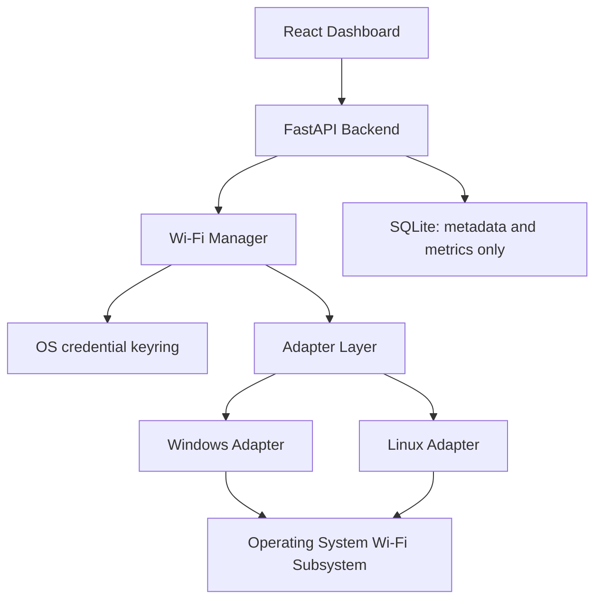
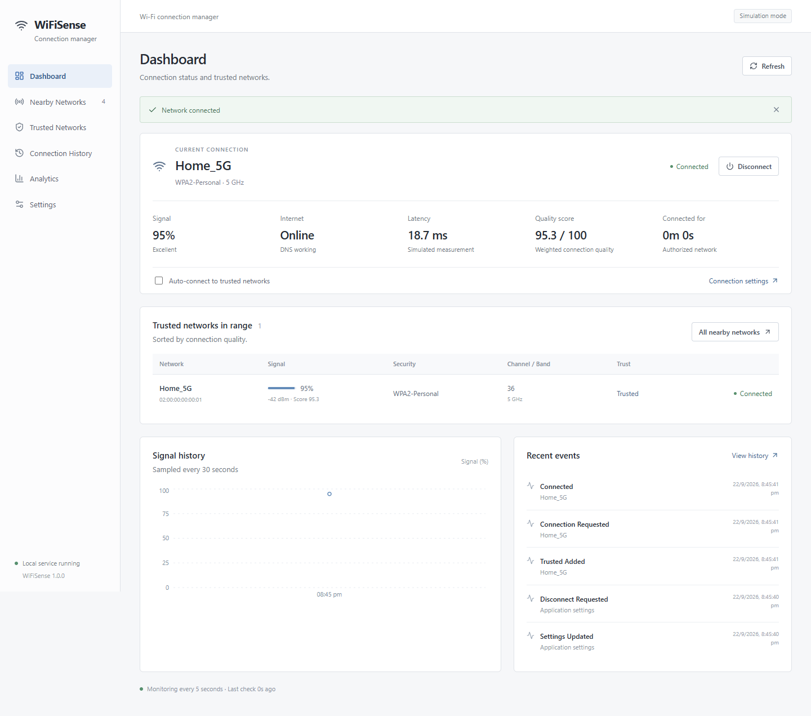

# WiFiSense
### Intelligent Wi-Fi Auto-Selection and Secure Connection Manager

A local-first Wi-Fi manager with a responsive React dashboard, FastAPI service,
quality-based ranking, trusted-network authorization, and sustained-improvement roaming.
Designed for education and management of your own networks.

**No cracking, password discovery, interception, authentication bypass, deauthentication,
packet injection, or unauthorized connections.** Every managed connection must match
an explicitly authorized database entry. Credentials must be supplied by the user.

## Features

- Nearby SSID/BSSID, signal, security, band/channel, connected and trusted status.
- OS keyring credential storage.
- Weighted signal, internet availability, latency and stability ranking.
- User priorities, preferred network, per-network automation controls.
- Hysteresis, cooldown and failure backoff; manual disconnect pauses automation.
- Lightweight connectivity checks for the connected, trusted network.
- SQLite history, audit events, periodic metrics, and 30-day retention.
- Six dashboard pages with Recharts analytics, responsive layout, readable errors.
- Initially empty trusted list, auto-connect initially disabled.
- Local-only API with Host, Origin and mutation-header checks.

## Architecture



See [architecture](docs/architecture.md), [security](docs/security.md), and [setup](docs/setup.md).

## Requirements

Python 3.11+, Node.js 22+, npm, Git. A supported wireless
adapter, user-session access to an unlocked secure keyring, and WLAN/NetworkManager permissions.
Use one backend process (one worker) so only one manager controls the adapter.

**Native-only runtime:** Windows WLAN / Linux NetworkManager are used by default. Simulation and browser demo modes have been removed. Set `WIFISENSE_MODE=system` or leave it unset; an old simulation value must be removed from your environment.

## Quick start — Windows PowerShell

From the repository root:

```powershell
py -m venv .venv
.\.venv\Scripts\python.exe -m pip install -r backend/requirements.txt
cd backend
# Optional: set WIFISENSE_INTERFACE if multiple adapters are present
$env:WIFISENSE_INTERFACE="Wi-Fi"
..\.venv\Scripts\python.exe -m uvicorn app.main:app --host 127.0.0.1 --port 8000
```

In another terminal:

```powershell
cd frontend
npm ci
npm run dev
```

Open http://127.0.0.1:5173. Use **Nearby Networks → Trust network**, enter the
passphrase (8–63 characters), explicitly authorize the network,
then connect. Add multiple networks to try ranking. Enable auto-connect in Settings.

Networks are **not automatically trusted**. Credentials are stored in the OS keyring.

## Linux setup

```bash
python3 -m venv .venv
.venv/bin/python -m pip install -r backend/requirements.txt
cd backend
# Optional: set WIFISENSE_INTERFACE if multiple adapters are present
WIFISENSE_INTERFACE=wlan0 ../.venv/bin/python -m uvicorn app.main:app --host 127.0.0.1 --port 8000
# separate terminal, repository root:
cd frontend
npm ci
npm run dev
```

See setup documentation for supported security types and platform limitations.
No saved OS profiles are implicitly imported as trusted networks.

## Production assets, local hosting

```bash
cd frontend
npm run build
```

Restart the backend after building. It serves the compiled dashboard at
http://127.0.0.1:8000. Development uses Vite's `/api` proxy.
Do not expose this personal single-user service to the LAN or internet.

## API

Interactive schema: http://127.0.0.1:8000/docs. Write requests must include
`X-WiFiSense: local-dashboard`; credentials are write-only and validation responses
omit rejected inputs. Example endpoint inventory:

| Method | Endpoint | Purpose |
| --- | --- | --- |
| GET | /api/wifi/current | Current network and connectivity |
| GET | /api/wifi/scan | Cached/rate-limited nearby scan |
| GET, POST | /api/wifi/trusted | List / explicitly authorize |
| PATCH, DELETE | /api/wifi/trusted/{id} | Priority, automation / forget |
| POST | /api/wifi/connect/{id} | Connect an authorized network |
| POST | /api/wifi/disconnect | Disconnect and pause automation |
| POST | /api/wifi/auto-connect/enable | Enable automatic selection |
| POST | /api/wifi/auto-connect/disable | Disable automatic selection |
| GET | /api/wifi/history | Audit events; limit and offset |
| GET | /api/wifi/metrics | Recent signal and connection samples |
| GET, PUT | /api/settings | Read / validate settings |
| GET | /api/system/status | Mode, adapter, monitor and error status |

## Testing

```powershell
cd backend
..\.venv\Scripts\python.exe -m pytest -q
cd ../frontend
npm run build
npm test
```

Linux uses `../.venv/bin/python -m pytest -q`. For browser tests on Linux,
first run `npx playwright install --with-deps chromium`.
Windows browser tests use installed Microsoft Edge.
Browser tests start their own isolated test backend on port 8000 and Vite on
5173; stop development servers on those ports first. They exercise trust, connect,
all six pages, settings persistence, disconnect, desktop and mobile layout.
Automated tests never need a real wireless adapter.

## Screenshots



[Mobile dashboard](docs/screenshots/dashboard-mobile.png). These are synthetic test
fixtures from the verified browser workflow. See [verification record](docs/verification.md).

## Troubleshooting

- Backend unavailable: start port 8000 first; open the UI on exactly localhost or 127.0.0.1.
- No trusted candidates: explicitly authorize a visible network and enable its automation.
- Keyring unavailable: unlock your login keyring; never install a plaintext fallback.
- Wrong password: remove and re-add the trusted entry; failures back off before retrying.
- No internet: TCP endpoint or DNS may be blocked; this is not captive-portal detection.
- Native adapter errors: verify radio, WLAN service / NetworkManager, location permission,
  selected interface and OS language. See [setup](docs/setup.md).
- Frontend `npm` points to a broken global shim: use the npm bundled with your Node installation.

## Security & limitations

Read [security](docs/security.md). This is a single-user local service, not an authenticated
multi-user LAN controller. Existing OS Wi-Fi auto-connect behavior remains independent;
WiFiSense never modifies unrelated OS profiles. SSID/BSSID are not cryptographic
network identities. Enterprise Wi-Fi, WEP, captive portals, hidden networks and
multi-adapter routing need additional work. Packet-loss percentage remains null
because one lightweight probe is insufficient to estimate it responsibly.
Measurements can use the OS default route (including VPN/Ethernet); they are not
guaranteed to isolate the Wi-Fi interface. Native hardware validation is separate
from hardware-free mocked testing. This native-only update has not been tested.

## GitHub & contributions

Repository: https://github.com/krishnacode120/WiFiSense

See [contribution guidelines](CONTRIBUTING.md).

```bash
git init
git branch -M main
git status
git add .
git commit -m "Initial commit: WiFiSense connection manager"
gh repo create WiFiSense --public --source=. --remote=origin --description "Intelligent Wi-Fi auto-selection and secure connection manager (educational/personal use)"
git push -u origin main
```

If necessary, run `gh auth login` interactively. Never paste an access token into a
source file. Before every push, inspect staged paths and run the repository hygiene
check. MIT licensed. Submit focused pull requests with tests; all future features must
preserve explicit trust authorization.

## Future improvements

First, validate the native adapters on controlled Windows and Linux test hardware.
Then consider desktop packaging, captive-portal detection, notifications, report
exports, device-bound quality probes and schema migrations. Raspberry Pi, ESP32,
multi-device monitoring, heatmaps and ML prediction are extension points, not implemented
features.

## Vercel deployment

The hosted page directs you to the local application; it does not generate fake networks or collect credentials. Real Wi-Fi management requires the local Python service. See [Vercel deployment](docs/vercel.md).
